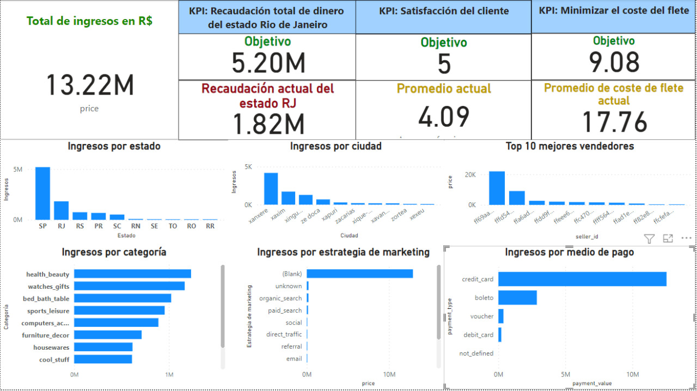

# Informe semana 3

## **1.KPIS y métricas** 

**KPI's:**
- Minimizar el coste de los fletes:  
> Promedio actual: 17.76 R$  
  Meta: 9.08 R$  
  Propuesta: Incentivar a que más personas vendan sus productos en estados en los que hagan falta.  
  
- Aumentar el volumen de recaudación de dinero en estados diferentes a Sao Paulo.  
> Recaudación total de ventas en Sao Pablo (meta): 5.20M R$  
  Recaudación total de ventas en Rio de Janeiro: 1.82M R$   
  Propuesta: Incentivar a que más personas vendan sus productos en estados en los que hagan falta.  
  
- Satisfacción del cliente medida en el puntaje de los usuarios por producto: 
> Promedio actual: 4.09    
  Meta: 5     
  Propuesta para mejorar el análisis: Añadir un sistema que permita al usuario puntuar según diferentes motivos tales como: Tiempo de entrega, calidad del producto, diseño de la página de ventas, etc.
  

**Métricas**

- Identificar cuáles son las categorías de productos con mayor y menor recaudación monetaria.

- Identificar cuáles son las ciudades con mayor número de ventas.

- Identificar cuáles son los estados con mayor número de ventas.

- Identificar la estrategia de captación de clientes más efectiva.

- Identificar a los mejores vendedores.

- Identificar cuáles son los medios de pago más y menos usados. 

## **2.Reglas de negocios aplicadas**  
Con el fin de lograr mayor compromiso y fidelidad de los mejores vendedores, los vamos a categorizar según sus principales virtudes, que pueden ser:
-Cantidad de ventas (los que más ventas hicieron o los que más plata recaudaron)
-Por velocidad (menores tiempo de envío respecto de la media)
-Por calidad (mejores calificaciones respecto de la media por categoría de producto)
La idea es que la plataforma muestre una insignia en cada uno de estos compradores así los consumidores se ven más tentados por estos productos y los vendedores tienen incentivos a mejorar su oferta.

## **3.Modelo predictivo**  
Por medio de un modelo de regresión lineal, hicimos una calculadora con interfaz web que calcula el costo de envío según el peso, volumen y la región donde se encuentra el comprador.

## **4.Proponer un machine learning para el futuro**  

